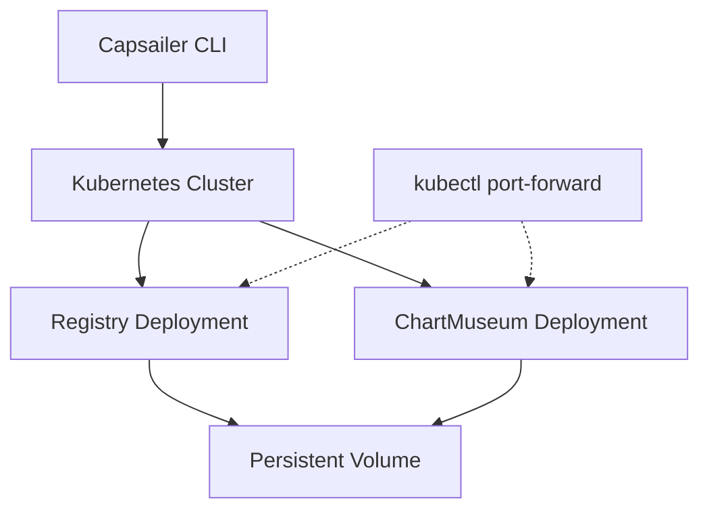

# Registry & Chart Repository

Capsailer sets up a complete infrastructure for hosting container images and Helm charts in air-gapped environments. This page explains how these components work together.

## Components

### Docker Registry

The Docker registry is a server-side application that stores and distributes container images. In Capsailer, it's deployed as a Kubernetes service in the specified namespace.

Key characteristics:
- Deployed as a Kubernetes deployment with a service
- Optionally uses persistent storage for durability
- Accessible within the cluster via `registry.<namespace>.svc.cluster.local:5000`
- Provides standard Docker Registry HTTP API

### ChartMuseum

ChartMuseum is a Helm Chart Repository server that stores and serves Helm charts. Capsailer deploys ChartMuseum alongside the Docker registry.

Key characteristics:
- Deployed as a Kubernetes deployment with a service
- Uses the same persistent storage as the registry (when enabled)
- Accessible within the cluster via `chartmuseum.<namespace>.svc.cluster.local:8080`
- Provides REST API for chart management

## Architecture



The registry and ChartMuseum share the same namespace and can optionally use the same persistent volume for storage. This ensures that both container images and Helm charts persist across pod restarts.

## How Capsailer Uses These Components

### During Push Operations

When you run `capsailer push`:

1. The CLI establishes connectivity to the registry and ChartMuseum
2. Container images are pushed directly to the registry using the Docker Registry API
3. Helm charts are published to ChartMuseum using its REST API
4. Port-forwarding is used to access these services from outside the cluster

### During Deploy Operations

When you run `capsailer deploy`:

1. The CLI checks if the requested chart exists locally
2. If not found locally, it queries ChartMuseum for the chart
3. If found in ChartMuseum, it downloads the chart
4. The chart is then deployed, with image references rewritten to use the local registry

## Port-Forwarding

Capsailer uses Kubernetes port-forwarding to access the registry and ChartMuseum services:

```bash
kubectl port-forward -n <namespace> svc/registry 5000:5000
kubectl port-forward -n <namespace> svc/chartmuseum 8080:8080
```

This approach:
- Doesn't require exposing services externally
- Works consistently across different Kubernetes environments
- Avoids the need for ingress controllers or load balancers

## Persistent Storage

When deployed with persistence enabled (the default), the registry and ChartMuseum use a Kubernetes Persistent Volume to store data. This ensures that:

- Images and charts survive pod restarts
- Data is preserved even if the pods are rescheduled to different nodes
- Multiple replicas can share the same storage (with appropriate access modes)

## Security Considerations

The registry and ChartMuseum deployed by Capsailer:

- Are intended for use in air-gapped environments
- Do not have authentication enabled by default
- Are not exposed outside the cluster by default
- Should be secured appropriately if exposed externally

For production use in sensitive environments, consider:
- Enabling authentication
- Using network policies to restrict access
- Setting up TLS for encrypted communications 