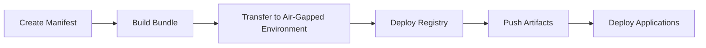

# Capsailer

<div style="text-align: center; margin-bottom: 40px;">
  <h2>Air-Gapped Kubernetes Deployments Made Easy</h2>
</div>

Capsailer is a CLI tool for delivering Kubernetes applications into air-gapped (offline) environments. It provides a complete solution for packaging, transporting, and deploying applications in environments without internet access.

## Key Features

- **Bundle Creation** - Package container images and Helm charts into a portable archive
- **Registry Infrastructure** - Deploy a container registry and Helm chart repository
- **Push Mechanism** - Upload images and charts without requiring external tools
- **Application Deployment** - Deploy applications using Helm with locally available artifacts
- **Self-contained** - No dependencies on Docker or other external tools in air-gapped environments

## Why Capsailer?

Deploying applications in air-gapped environments presents unique challenges:

- No access to public container registries like Docker Hub
- No access to public Helm chart repositories
- Limited tooling available in the restricted environment

Capsailer addresses these challenges by providing an all-in-one solution that bundles everything needed for deployment and handles the entire workflow without external dependencies.

## How It Works



1. **Define your requirements** in a manifest file
2. **Build a portable bundle** with all images and charts
3. **Transfer the bundle** to the air-gapped environment
4. **Deploy a local registry** for images and charts
5. **Push artifacts** from the bundle to the registry
6. **Deploy applications** using the local artifacts

## Quick Start

```bash
# Create a manifest file
cat > manifest.yaml << EOF
images:
  - nginx:1.25.0
  - redis:7.0.14
charts:
  - name: nginx
    repo: https://charts.bitnami.com/bitnami
    version: 15.1.4
EOF

# Build a bundle
capsailer build --manifest manifest.yaml --output bundle.tar.gz

# In air-gapped environment
capsailer registry
capsailer push --bundle bundle.tar.gz
capsailer deploy --chart nginx
```

Ready to get started? Check out the [Installation Guide](getting-started/installation.md) or dive into the [Quick Start Tutorial](getting-started/quick-start.md). 